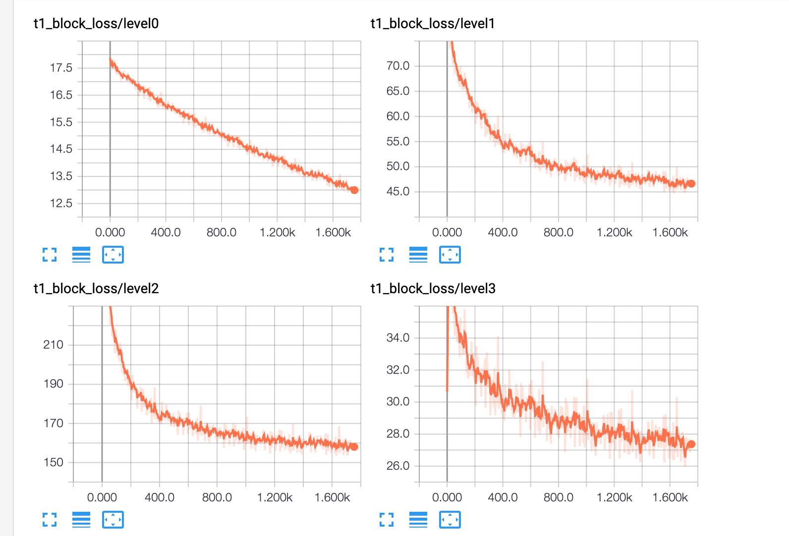

# KnowledgeAmalgamationModule
My Tensorflow Implementation of **Customizing Student Networks From Heterogeneous Teachers via Adaptive Knowledge Amalgamation** 
[https://arxiv.org/abs/1908.07121](https://arxiv.org/abs/1908.07121)

Currently support classifying of MNIST data, amalgamate knowledge from the models which  are trained on MNIST.

## Requirements
Tested on Python 3.6 and Tensorflow 1.14 with 1080Ti (CUDA 10.0). I recommend that you can make a virtual environment to run this code. 

Please use the followed code to install the required package.

```bash
pip install -r requirements.txt
```

## Repository Overview
* `models.py` contains the implementation of training model include component net (supervised) and target net (unsupervised).
* `dataset.py` contains the implementation of loading the MNIST dataset.
* `sample.py` contains the implementation of FeatureAlignmentModule and Block-wise Loss
* `callbacks.py` contains the implementation of Tensorboard callback.

## Runing the Code 

```bash
python ./models.py --step=1
```
This will train the component net by MNIST supervision. After that, we can get the well-trained component net
(In the paper, the component is obtained by unsupervised training, but we trained it by labeled data for sake of simplicity).

* `step=2` represents that we unsupervised train the source net. 
* `step=3` represents that evaluate the effectiveness of source net. 

## Released Model 
- Google Drive
    - [0_1.h5]()
    - [2_3.h5]()
    - [0_1_2_3.h5]()
- Baidu 
    - [0_1.h5](https://pan.baidu.com/s/1OD0aaGSaWS2FS7BYQbR0sQ)
    - [2_3.h5](https://pan.baidu.com/s/1dkxyKguSS-oyzrRzLz9TbA)
    - [0_1_2_3.h5](https://pan.baidu.com/s/1dhLcOYFibzYg3qM8vQDxIA)
## Result
- The loss curves are shown as follow:

- First, the accuracy between 0 and 1 is 1.0. the accuracy between 2 and 3 is 0.99.
- Then, the final 4-classes (0-1-2-3) classification accuracy is 0.92