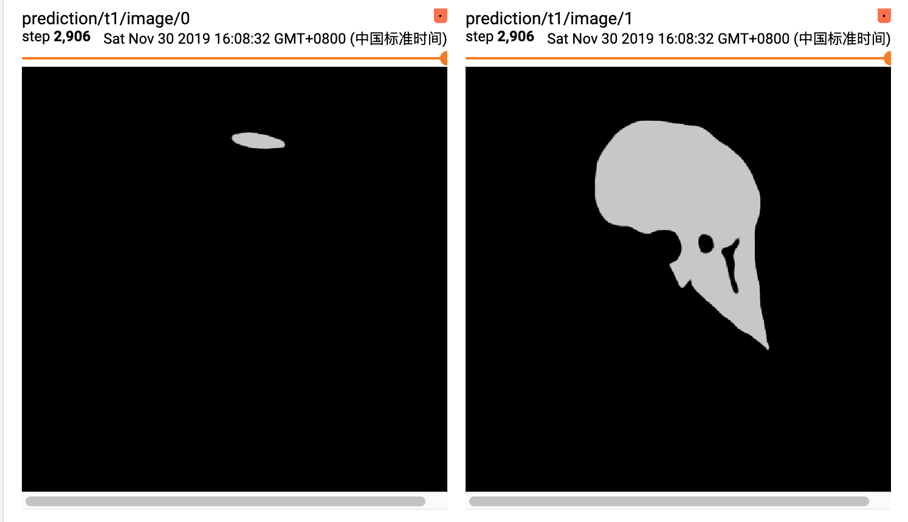
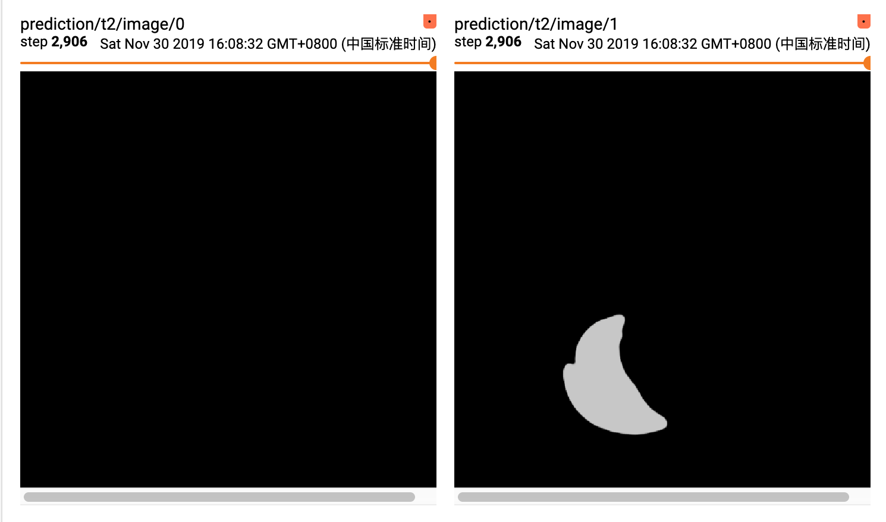
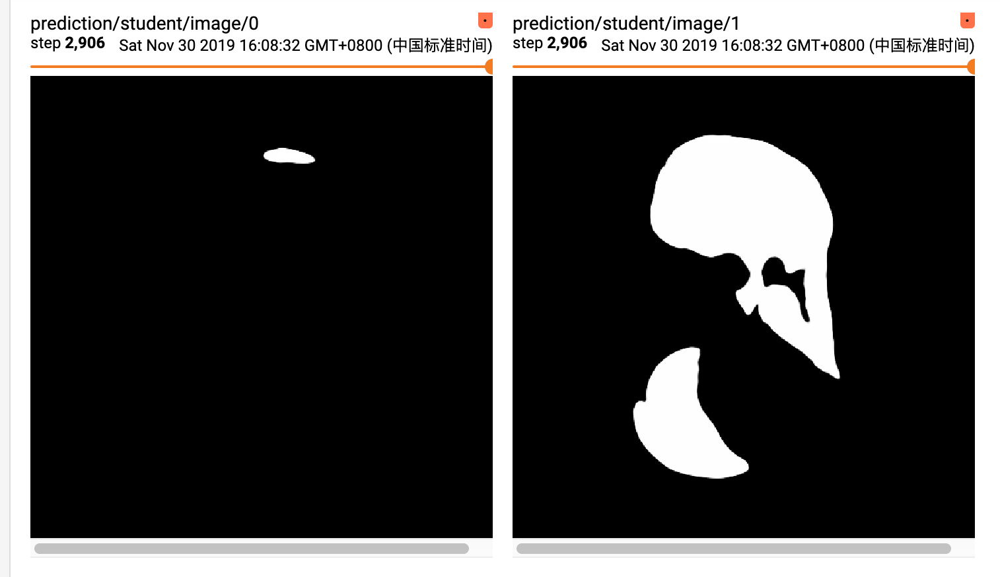

# Unsupervised Multi-Organ Segmentation based on Knowledge Distillation
## Requirements
Tested on Python 3.6 and Tensorflow 1.14 with 1080Ti (CUDA 10.0). I recommend that you can make a virtual environment to run this code. 

Please use the followed code to install the required package.

```bash
pip install -r requirements.txt
```

After install keras_segmentation package, we need to modify some source code to run our code.

The modified code see in ./modify_source_code.md
## How to restore
## How to evaluation 
## How to train
In this section, we introduce how to train our proposed model, which contain two steps: 
train teacher models with supervision and train student model without supervision.

### Train Teahcer Model

### Train Student Model
After finished train teacher model, we can start to train stduent model to do knowledge distillation.

execute this sh file to train the custom student model
```bash
chmod 777 ./train_student_model.sh
./train_student_model.sh
```
The configuration of teacher models and student model is shown in `train_student_model.py`

## Visualization
The visualized result of teacher1(liver), teacher2(spleen), student(liver+spleen) are shown as followed:




## Result
* the dice of teacher1(liver) is 

* the dice of teacher2(spleen) is
 
* the dice of student is 

* the dice of teacher1 + teacher2 is 

 